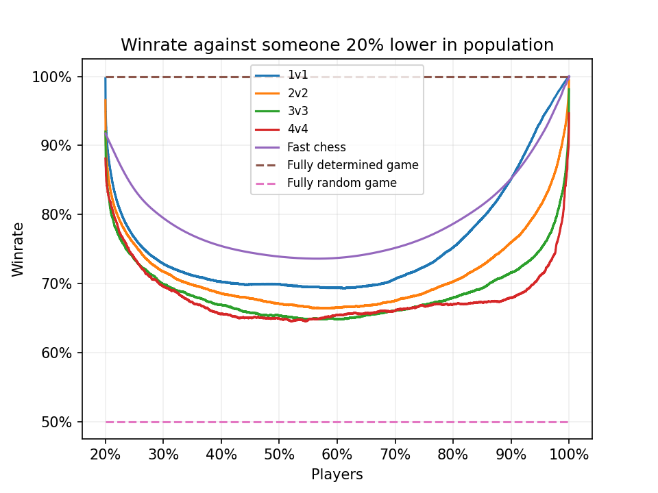

# SC2 MMR stats (seasons 47)

Playing around with various MMR stats provided by Nephest (https://www.nephest.com/sc2)

# Results

Distribution of MMR. League targets taken from liquidpedia (https://liquipedia.net/starcraft2/Battle.net_Leagues). Actual MMR ranges are quite close to those calculated and shown here.

When comparing different regions, we can see that KR is more shifted towards higher MMRs. That's likely because of a lot more professional players and fewer total players. MMR will shift toward higher ranges to accomodate a different player distribution.

MMR distribution across leagues for 1v1. The biggest skill differences can be found in Bronze and Grandmaster leagues, followed up by the Master league.

Comparing MMR distribution between different modes. Fast chess data taken from here (https://www.chess.com/leaderboard/live/rapid), and rescaled `MMR = 2.2*ELO` (based on [this thread](https://www.reddit.com/r/starcraft/comments/6dn6jf/does_anybody_have_more_detailed_stats_on_mmr/)).

Both a game, mode, and a population affects how this charts looks. For StarCraft II, we see that the biggest skill differences in 1v1, followed by 2v2, 3v3 and 4v4. As expected, in 1v1 a single player skill has the biggest impact on the game's outcome. With more players the impact gets progressively smaller, and in 4v4 it's the smallest.

We see even bigger skill impact in the fast chess population, and that's while it being only a subset of the actual chess players. This indicates that fast chess is even more skill-based than StarCraft II, or that its population is more diverse than that of StarCraft II ladder in terms of skill.

 

An alternative visualization of the previous data but with winrates calculated based on the [difference in ELO](https://en.wikipedia.org/wiki/Elo_rating_system#Mathematical_details). The winrate based on a MMR difference was calculated the same way as ELO, but with `MMR = 2.2*ELO` conversion.

The chart shows the previous thrend even better. From the highst skill differences in player population to the lowest: Fast chess > 1v1 > 2v2 > 3v3 > 4v4 (noisy, not enough games).
