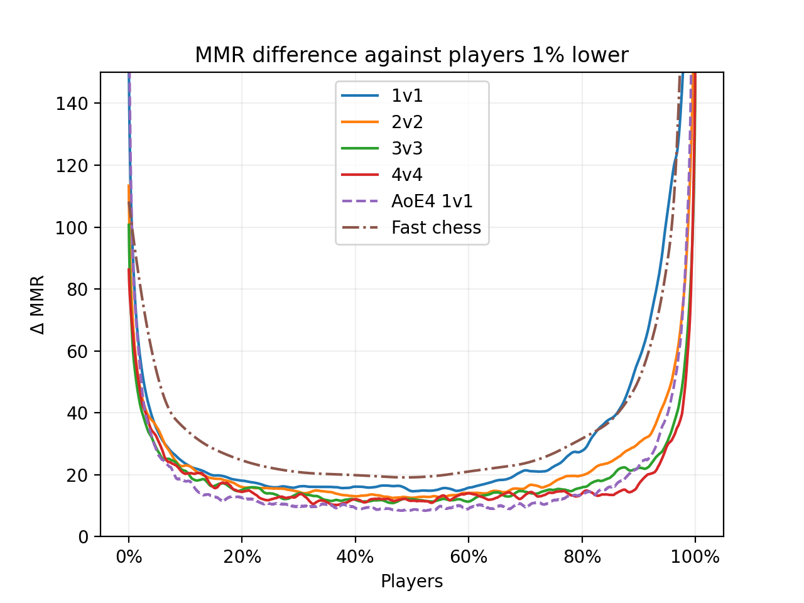
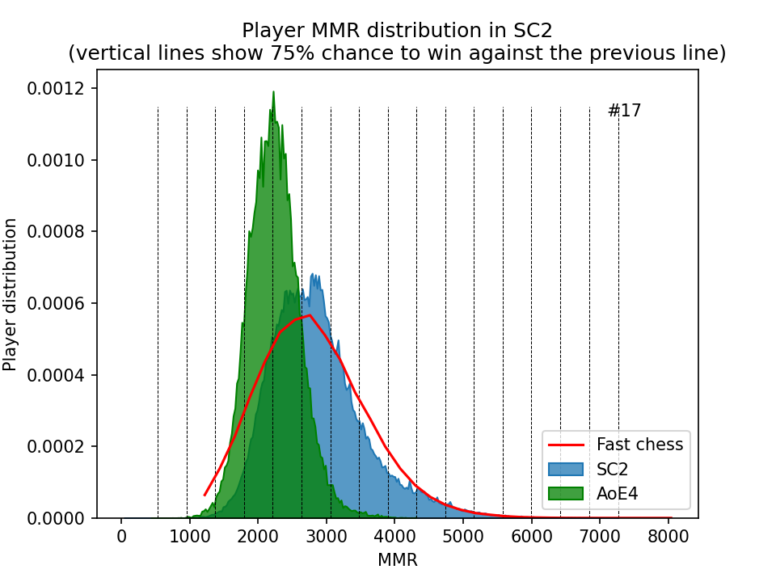

# SC2 MMR stats (seasons 47)

Playing around with various MMR stats provided by Nephest (https://www.nephest.com/sc2)

#

Distribution of MMR. League targets taken from liquidpedia (https://liquipedia.net/starcraft2/Battle.net_Leagues). Actual MMR ranges are quite close to those calculated and shown here.

Silver, Gold and Platinum leagues are nicely tugged together but still spanning ~1300 MMR, meaning there is still a big range of skill in these leagues.

After quickly comparing different regions, we can see that KR is more shifted towards higher MMRs. That's likely because of a lot more professional players and fewer total players. MMR will shift toward higher ranges to accommodate a different player distribution.

MMR distribution across leagues for 1v1. The biggest skill differences can be found in Bronze and Grandmaster leagues, followed up by the Master league.

Comparing MMR distribution between different modes. Fast chess data were taken from here (https://www.chess.com/leaderboard/live/rapid), and rescaled `MMR = 2.2*ELO` (based on [this thread](https://www.reddit.com/r/starcraft/comments/6dn6jf/does_anybody_have_more_detailed_stats_on_mmr/)).

Both a game, mode, and population affect how this chart looks. For StarCraft II, we see that the biggest skill differences in 1v1, followed by 2v2, 3v3 and 4v4. As expected, in 1v1 a single player skill has the biggest impact on the game's outcome. With more players the impact gets progressively smaller, and in 4v4 it's the smallest.

Fast chess population spans essentially the same MMR range as 1v1 in StarCraf II, however, the population is much more equally distributed between different MMR/ELO brackets. We don't see the same Bronze league that contains only a small number of players but with a major difference is in skill. That's likely because the (fast) chess population is bigger than what data obtained from the single site shows, and fast chess highlights the skill difference between players even better than 1v1 in StarCraft II.

| Game mode  | MMR range 
:---: |  :---:
|1v1 | 32 – 7280 |
|2v2 | 1154 – 5301 |
|3v3 | 1571 – 4809 |
|4v4 | 1872 – 4494 |
|2v2 arranged | 1028 – 5659 |
|3v3 arranged | 102 – 7042 |
|4v4 arranged | 270 – 7185 |
|Fast chess | 220 – 7260 |

 

An alternative visualization of the previous data but with winrates calculated based on the [difference in ELO](https://en.wikipedia.org/wiki/Elo_rating_system#Mathematical_details). The winrate based on an MMR difference was calculated the same way as ELO, but with `ΔELO = ΔMMR/2.2` conversion. 260 MMR difference results in 66% winrate, 420 difference in 75%, and 1120 difference in 95%.

This chart shows the previous trend even better. From the highest skill differences in player population to the lowest: Fast chess > 1v1 > 2v2 > 3v3 > 4v4. 

Arranged teams are more closer to 1v1, particularly for the players in 85-100% part of the population. Elsewhere the difference is rather small.

I added how a fully random and fully determined game would look like. A fully random game might be a game of *rock-paper-scissors* (if played well), and a fully determined game could be comparing persons heights (assuming a single precise measurement). Normal games fall somewhere in-between due to [various sources of randomness](https://www.maguro.one/2021/06/TR09-gameplay-variety.html#sources) (execution, built-in, etc.) (pushes down) and player's skill (pushes up). The higher the game is in this chart, the most accurately it tells a player skill and/or there is a wider skill difference in its population – since we are comparing against players x% lower in population. Using a fixed value (e.g. 1000 players down) would have a similar dependency on the population.

A similar story aries when just comparing MMR difference against 1% population lower as MMR difference is closely tied with winrates. You would get a very similar chart if you plotted winrate against players 1% lower. 

We see the most difference in MMR/winrate is in the lowest and highest leagues.

Another way to represent skill distribution across population that's comparable across games. The vertical lines represent where a player has expected 75% chance of winning against previous vertical line. The more lines there are, the wider skill is in the player population.